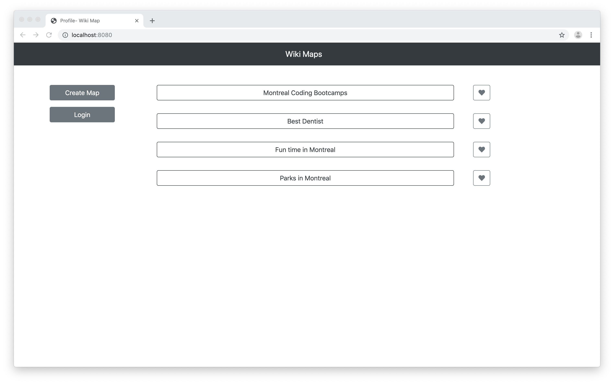
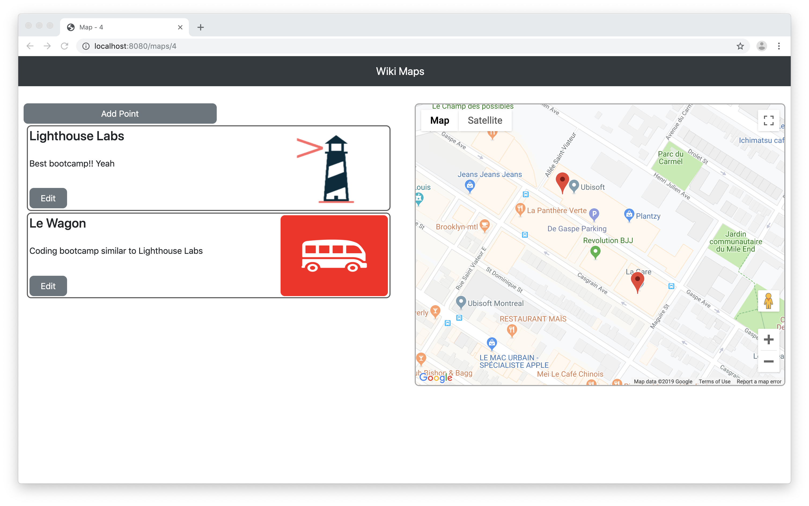
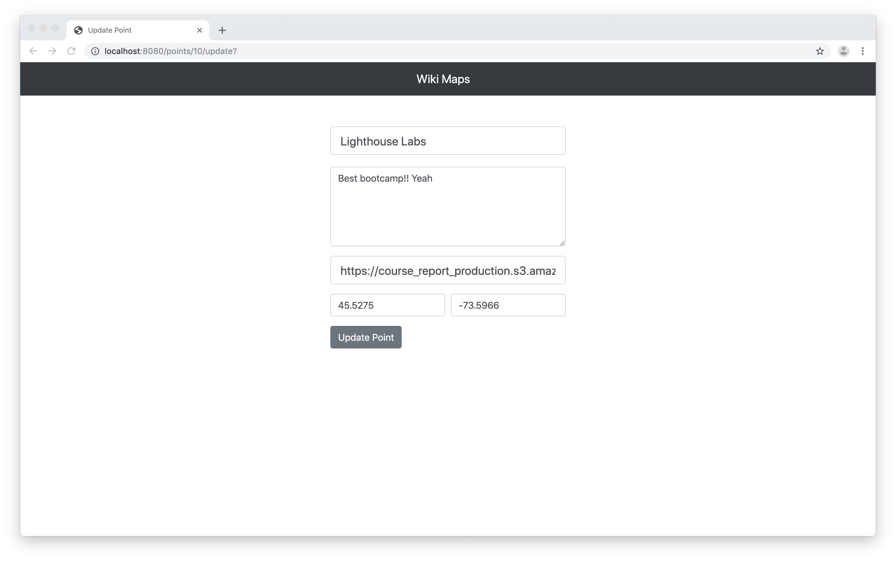

# Wiki Maps

Wiki Maps is a application that allows the user to create custom-themed maps. The user adds points of interest to the map along with a photo and description. Users can contribute to other people's maps and favourite a map.

### Front-end:
Wiki Maps is a multi-page app that uses the [jQuery](https://jquery.com/) library and [ejs](https://www.npmjs.com/package/ejs) templates to render the pages. The application interacts with the [Google Maps API](https://developers.google.com/maps/documentation/javascript/tutorial) to show the user-created point on the map.

### Back-end & Database:
The server is built using [node.js](https://nodejs.org) and [express](https://expressjs.com/) and the database is [PostgreSQL](https://www.postgresql.org/). Wiki Maps uses [knex](https://knexjs.org/), a query builder for SQL databases written for Javascript which allows node.js to query the PostgreSQL database.

## Screenshots

### Home Page

### Map View

### Edit Map

### Profile View

## Getting Started
1. Create the `.env` by using `.env.example` as a reference
2. Update the .env file with your correct local information (DB_USER & DB_PASS)
3. Install dependencies: `npm install`
4. Fix to binaries for sass: `npm rebuild node-sass`
5. Run migrations: `npm run knex migrate:latest`
  - Check the migrations folder to see what gets created in the database
6. Run the seed: `npm run knex seed:run`
  - Check the seeds file to see what gets seeded in the database
7. Run the server: `npm run local`
8. Visit `http://localhost:8080/`

## Dependencies
- [node.js](https://nodejs.org)
- [express](https://expressjs.com/)
- [body-parser](https://www.npmjs.com/package/body-parser)
- [Cooke-parser](https://www.npmjs.com/package/cookie-parser)
- [dotenv](https://www.npmjs.com/package/dotenv)
- [ejs](https://www.npmjs.com/package/ejs)
- [knex](https://www.npmjs.com/package/knex)
- [knex-logger](https://www.npmjs.com/package/knex-logger)
- [morgan](https://www.npmjs.com/package/morgan)
- [node-sass](https://www.npmjs.com/package/node-sass)
- [node-sass-middleware](https://www.npmjs.com/package/node-sass-middleware)
- [pg](https://www.npmjs.com/package/pg)
